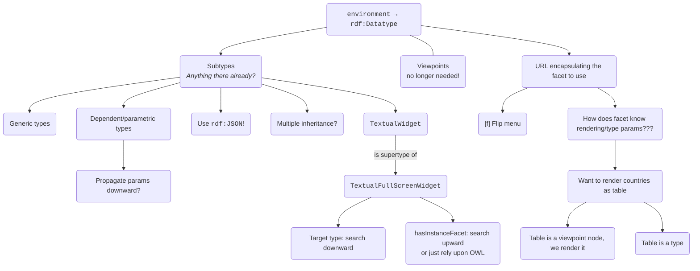

## Context

I need to flip between facets when looking at the same node.

A few changes needed for that.

## Decision

* [ ] Create and call a Flip page to list all applicable facets
* [ ] Run specific facet on click
* [ ] And then work on env → type migration
