# Advanced Knowledge Graph Techniques in Iolanta<br/><small>Assignment for MC-3 Fall 2025 © Anatoly Scherbakov</small>

This document extends the Iolanta knowledge graph design presented in [MC-1](/blog/knowledge-graph-assignment/) and [MC-2](/blog/knowledge-graph-assignment/mc2/), demonstrating advanced constructs and techniques from MC-3 "Build with Nuance".

## :material-numeric-1-box: Wikidata as a part of Knowledge Commons <small>Advanced Topic</small>

[Wikidata](https://wikidata.org) is a part of Knowledge Commons. As a huge repository of machine readable knowledge, Wikidata is a very interesting target for data visualization.

```shell
iolanta http://www.wikidata.org/entity/Q204606
```

[](/screenshots/www.wikidata.org.entity.q204606.svg)

Most elements here are interactive. For instance, if you click **cybersecurity** then you should see something like this:

```shell
iolanta http://www.wikidata.org/entity/statement/Q204606-fd8d7c8a-431b-1444-80ef-bb3c0cb139a9
```

[](/screenshots/www.wikidata.org.entity.statement.q204606-fd8d7c8a-431b-1444-80ef-bb3c0cb139a9.svg)

Why does the URL say `statement`? What does it mean? It is a hint that Wikidata extensively uses <strong>reification</strong>.

## :material-numeric-2-box: Reification in Wikidata <small>Main Topic</small>

The basis for reification is a specialized `Statement` class in Wikidata ontology.

!!! info inline end
    This illustrates that `rdf:Statement` is not the only possible basis for reification.

The Statement class itself doesn't reveal much about its structure.

```shell
iolanta http://wikiba.se/ontology#Statement
```

[](/screenshots/wikiba.se.ontology.statement.svg)

The fragment of knowledge we are interested in is that <strong>Cyberspace</strong> is associated with the <strong>field of work</strong> which is <strong>cybersecurity</strong>.

Instead of expressing this as one triple, Wikidata uses a much more complicated structure. The diagram below visualizes how the simple fact that Cyberspace has the field of work cybersecurity is represented through reification:

```mermaid
graph LR
    Q204606("<strong>Cyberspace</strong><br/><small><code>entity/Q204606</code></small>")
    PROP_P101("<strong>field of work</strong><br/><small><code>prop/P101</code></small>")
    STMT("<strong>Statement</strong><br/><small><code>statement/Q204606-...</code></small>")
    PROP_STMT_P101("<strong>field of work</strong><br/><small><code>prop/statement/P101</code></small>")
    VALUE("<strong>cybersecurity</strong><br/><small><code>entity/Q17233037</code></small>")
    RANK("<strong>rank</strong><br/><small><code>wikibase:rank</code></small>")
    NORMAL_RANK("<strong>NormalRank</strong><br/><small><code>wikibase:NormalRank</code></small>")
    LABEL("<strong>label</strong><br/><small><code>rdfs:label</code></small>")
    LABEL_VALUE("<strong>cybersecurity</strong><br/><small><code>literal</code></small>")
    
    Q204606 --- PROP_P101
    PROP_P101 --> STMT
    STMT --- PROP_STMT_P101
    PROP_STMT_P101 --> VALUE
    STMT --> RANK
    RANK --> NORMAL_RANK
    VALUE --> LABEL
    LABEL --> LABEL_VALUE

    classDef edgeLabel fill:transparent,stroke:transparent,color:#000

    class PROP_P101,PROP_STMT_P101,RANK,LABEL edgeLabel

    click Q204606 http://www.wikidata.org/entity/Q204606
    click PROP_P101 http://www.wikidata.org/prop/P101
    click STMT http://www.wikidata.org/entity/statement/Q204606-fd8d7c8a-431b-1444-80ef-bb3c0cb139a9
    click PROP_STMT_P101 http://www.wikidata.org/prop/statement/P101
    click VALUE http://www.wikidata.org/entity/Q17233037
    click RANK http://wikiba.se/ontology#rank
    click NORMAL_RANK http://wikiba.se/ontology#NormalRank
    click LABEL http://www.w3.org/2000/01/rdf-schema#label
```



Through reification, Wikidata is able to attach rank and other meta properties to statements, but the structure of the graph becomes more complicated, and the `Statement` instance has no attached human readable representation.

## :material-numeric-3-box: Reasoning to the Rescue <small>Main Topic</small>

We have a few potential solutions to this.

=== "✅ SPARQL inference"

    SPARQL inference uses `CONSTRUCT` queries to generate new triples that simplify the reified structure.

    <div class="grid" markdown>
    <div markdown>

    !!! success "Pro"

        - Explicit control over inference rules
        - Does not require a reasoner

    </div>
    <div markdown>

    !!! warning "Contra"
        - Requires writing and maintaining SPARQL queries
        - May need multiple rules for different patterns
        - Performance depends on query optimization
        - Might be verbose

    </div>
    </div>

=== "❌ OWL inference"

    OWL inference leverages ontology reasoning to automatically infer relationships and labels.

    <div class="grid" markdown>
    <div markdown>

    !!! success "Pro"

        Declarative and standards-based

    </div>
    <div markdown>

    !!! warning "Contra"

        - Requires an OWL reasoner (additional dependency)
        - OWL does not easily support property transfer: copying a property with its object from one subject to another

    </div>
    </div>

=== "❌ Custom facet logic"

    Custom facet logic implements domain-specific handling within Iolanta's facet system.

    <div class="grid" markdown>
    <div markdown>

    !!! success "Pro"

        - Tight integration with Iolanta's rendering system
        - Can leverage existing facet infrastructure
        - Domain-specific optimizations possible

    </div>
    <div markdown>

    !!! warning "Contra"

        - Requires Python code changes
        - Less reusable across different domains

    </div>
    </div>

So, we go with SPARQL reasoning. Let's examine the specific inference queries we use:

## :material-numeric-4-box: Querying Graphs <small>Main Topic</small>

Iolanta has several built-in inference SPARQL queries, each of these implements a `CONSTRUCT` statement. One of them is this:

```sparql title="wikidata-statement-label.sparql"
--8<-- "iolanta/sparqlspace/inference/wikidata-statement-label.sparql"
```

This query finds an `rdfs:label` for each `Statement` by traversing its related nodes in the graph.

For properties, we use this inference query:

```sparql title="wikidata-prop-label.sparql"
--8<-- "iolanta/sparqlspace/inference/wikidata-prop-label.sparql"
```

This query transfers labels from property entities (like `http://www.wikidata.org/entity/P101`) to their corresponding property URLs (like `http://www.wikidata.org/prop/P101`) by following the `wikibase:claim`, `wikibase:qualifier`, `wikibase:statementProperty`, or `wikibase:statementValueNormalized` relationships.

Together, these two inference queries enable readable labels for both statements and properties. Here's how they work in practice:

```shell
iolanta http://www.wikidata.org/prop/P101 --as title
```

[](/screenshots/www.wikidata.org.prop.p101.svg)

The inference rules automatically flatten the reified structure by inferring `rdfs:label` triples directly on property and statement URLs. This allows Iolanta's facets to work with simple label queries rather than navigating the complex Wikibase ontology structure.


## Conclusion

I haven't found an application of reification, OWL punning, probabilities, or RDF-Star in Iolanta ontology itself. In this document, I tried to demonstrate:

* How Iolanta implements inference with advanced SPARQL queries,
* And by that, we are able to untangle complex reification schemes, — and thus get the visualization we need.
