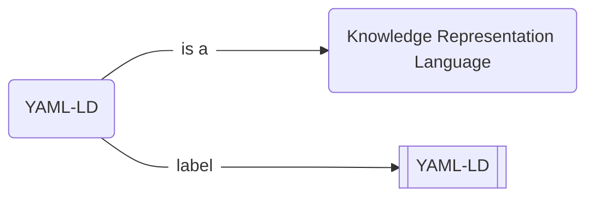

# `HOWTO` :pen_fountain: Write and publish a Nanopublication

# What is a nanopublication?

!!! danger "This is an α version"
    I am presently working on this article, and it is a very early alpha version. If you happen to read it before I am finished, please forgive the sketchiness. You are very welcome to contribute and to criticize though! Just [➕ open an issue on GitHub](https://github.com/iolanta-tech/iolanta/issues/).

I have been working on a thing called YAML-LD, and I want to tell the world what it is. I like infographics, so I might draw the following :simple-mermaid: Mermaid diagram.

{# TODO: Generate this diagram from YAML-LD file. #}



This graph obviously says that:

* YAML-LD is named "YAML-LD"<br/>(well *that* was unexpected),
* and it is a **knowledge representation language**,<br/>whatever *that* might be.
 
It does not concern us very much what these are. In your case, you might wish to inform the world about any other fact, like:

{# TODO: Each of these examples should link to a nanopub #}

* Mosquitoes bite humans,
* TRAPPIST-1 system has 7 planets,
* Pluto is not a planet,
* or even that,
    * even though **John Doe** says that **every dinosaur is a reptile**,
    * that statement is **false**,
        * because
            * Chicken is a dinosaur
            * Chicken is a bird, not a reptile.

All of these statements can be drawn as graphs similar to the above. Let's do so.

## :material-typewriter: Write the statement

Create a new file, called `yaml-ld.yamlld`, and run, in a separate terminal:

```shell
iolanta yaml-ld.yamlld
```

<div class="grid" markdown>
```shell title="yaml-ld.yamlld"
--8<-- "docs/howto/nanopublish/0.yamlld"
```

TODO: Render 0.yamlld here
</div>

{# TODO: Make the process step-wise, we are TEACHING how to write the nanopub; owl approach won't work. #}

---

Drawing the owl here... :owl:

---

```yaml title="yaml-ld.yamlld"
--8<-- "docs/howto/nanopublish/yaml-ld.yamlld"
```

## :eye_in_speech_bubble: Preview

{# TODO: Visualize this graph with Iolanta. #}

## :fontawesome-solid-stamp: Make it a valid Nanopublication

{# TODO: Describe how to install the `np` command #}

```shell
pyld expand yaml-ld.yamlld | np create from-assertion > np.yaml-ld.trig
```

## :material-rocket-launch: Publish!

```shell
np publish np.yaml-ld.trig
```
