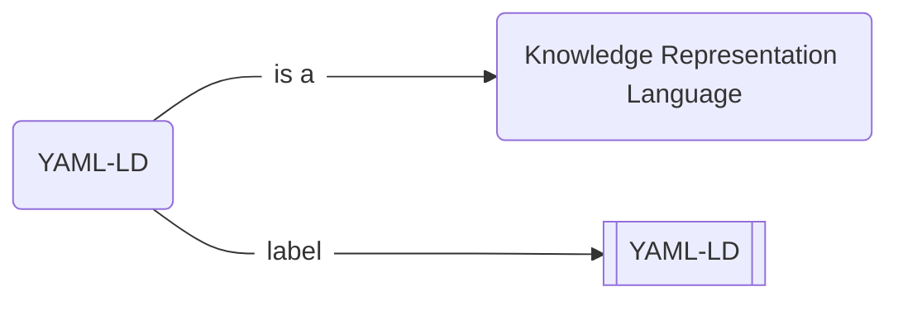
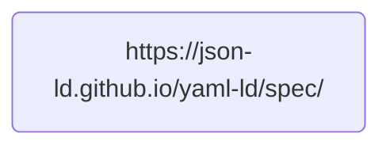

# `HOWTO` :pen_fountain: Write and publish a Nanopublication

# What is a nanopublication?

!!! danger "This is an α version"
    I am presently working on this article, and it is a very early alpha version. If you happen to read it before I am finished, please forgive the sketchiness. You are very welcome to contribute and to criticize though! Just [➕ open an issue on GitHub](https://github.com/iolanta-tech/iolanta/issues/).

I have been working on a thing called YAML-LD, and I want to tell the world what it is. I like infographics, so I might draw the following :simple-mermaid: Mermaid diagram.

{# TODO: Generate this diagram from YAML-LD file. #}



This graph obviously says that:

* YAML-LD is named "YAML-LD"<br/>(well *that* was unexpected),
* and it is a **knowledge representation language**,<br/>whatever *that* might be.
 
It does not concern us very much what these are. In your case, you might wish to inform the world about any other fact, like:

{# TODO: Each of these examples should link to a nanopub #}

* Mosquitoes bite humans,
* TRAPPIST-1 system has 7 planets,
* Pluto is not a planet,
* or even that,
    * even though **John Doe** says that **every dinosaur is a reptile**,
    * that statement is **false**,
        * because
            * Chicken is a dinosaur
            * Chicken is a bird, not a reptile.

All of these statements can be drawn as graphs similar to the above. Let's do so.

## Install prerequisites

In a Python 3.10+ environment, run:

```shell
pip install iolanta git+https://github.com/iolanta-tech/nanopub-py.git
```

## :material-typewriter: Write an Assertion

Create a new file, called `yaml-ld.yamlld`, and run, in a separate terminal:

```shell
iolanta yaml-ld.yamlld
```

<div class="grid" markdown>
<div markdown>
```shell title="yaml-ld.yamlld"
--8<-- "docs/howto/nanopublish/0.yamlld"
```

As you can see on the right, Iolanta has certain difficulties visualizing this document. Well, that's because there is nothing to visualize. The line starting from `#` is a comment in YAML, it is only written for a human reader; computer ignores it entirely.
</div>


</div>

### Step :material-roman-numeral-1:

<div class="grid" markdown>
<div markdown>
We are going to write something about YAML-LD; let's refer to it properly: as a URL. We can use the address of the current YAML-LD [specification draft](https://json-ld.github.io/yaml-ld/spec/).

```shell title="yaml-ld.yamlld"
--8<-- "docs/howto/nanopublish/with-id.yamlld"
```

Here, `@id` is a keyword that *`id`entifies* the thing we are going to talk about.

!!! info
    `"@id"` has to be in quotes, this is because `@` is a reserved character in YAML. More on that later.

However... Iolanta still cannot visualize this document, why is this?
</div>


</div>

### Step :material-roman-numeral-2:

<div class="grid" markdown>
<div markdown>
Ahem. Yes, indeed, I am sorry. The problem now is that the graph we have described only has one node, but no edges.



This degenerated form is not really a graph and is not quite supported by Iolanta, unfortunately. We need to *say something about* the thing that we had stated. Otherwise there's no semantics to talk about, no knowledge to express. Let's do that.

```yaml title="yaml-ld.yamlld" hl_lines="3 6"
--8<-- "docs/howto/nanopublish/with-label.yamlld"
```

And it works!
</div>


</div>


This display shows what is called a **triple**. Here,

* YAML-LD (red) is the _subject_,
* `label` is the _predicate_,
* and `YAML-LD` (black) is the _object_.

Subject and Predicate here are clickable, since they are URLs. Object is a string, or a Literal, and is therefore not clickable.


<div class="grid" markdown>
<div markdown>


<figcaption markdown>
[YAML-LD](https://www.w3.org/2000/01/rdf-schema#label) subject
</figcaption>
</div>

<div markdown>


<figcaption markdown>
[Label](https://www.w3.org/2000/01/rdf-schema#label) predicate
</figcaption>
</div>
</div>

As you can see, quite a bit of information is available about each. That's because files accessible via each of those URLs contain information about the concepts the URLs stand for.

That's called _Linked Data_.

### Step :material-roman-numeral-3:

<div class="grid" markdown>
<div markdown>
You will rightfully exclaim:

!!! warning "Exclamation © you"
    Are you saying I will have to type
    ```
    http://www.w3.org/2000/01/rdf-schema#label
    ```
    each time I want to specify a human readable label of something?

No, not really. Let's define a *context*.

```yaml title="yaml-ld.yamlld" hl_lines="2 5"
--8<-- "docs/howto/nanopublish/with-context.yamlld"
```

Context is the part of the document where we describe how to interpret this document as a Knowledge Graph. In this example, we introduce a shortcut, `rdfs`, which stands for RDFS ontology. In the body of the document we can refer to that ontology using that shorthand.

| Short form (CURIE) | Full Form                                      |
|--------------------|------------------------------------------------|
| `rdfs:label`       | `http://www.w3.org/2000/01/rdf-schema#label`   |
| `rdfs:seeAlso`     | `http://www.w3.org/2000/01/rdf-schema#seeAlso` |
| `rdfs:Class`       | `http://www.w3.org/2000/01/rdf-schema#Class`   |

</div>


</div>

### Step :material-roman-numeral-4:

<div class="grid" markdown>
<div markdown>
Let's reduce our typing effort a bit more.

```yaml title="yaml-ld.yamlld" hl_lines="2 5"
--8<-- "docs/howto/nanopublish/with-convenience-context.yamlld"
```
We import a context which remaps `@id` to `$id`, which does not have to be quoted. Cool, right?!
</div>


</div>


# :material-owl: Draw the owl!

<div class="grid" markdown>
<div markdown>
With the examples we've looked through, you will easily read the following YAML-LD statement.

```yaml title="yaml-ld.yamlld"
--8<-- "docs/howto/nanopublish/yaml-ld.yamlld"
```

At any rate, Iolanta is always ready to help by visualizing it. Each of the links is clickable,
leading you to further information about the concepts involved.
</div>


</div>


## :eye_in_speech_bubble: Preview

{# TODO: Visualize this graph with Iolanta. #}

## :fontawesome-solid-stamp: Make it a valid Nanopublication

{# TODO: Describe how to install the `np` command #}

```shell
pyld expand yaml-ld.yamlld | np create from-assertion > np.yaml-ld.trig
```

## :material-rocket-launch: Publish!

```shell
np publish np.yaml-ld.trig
```
