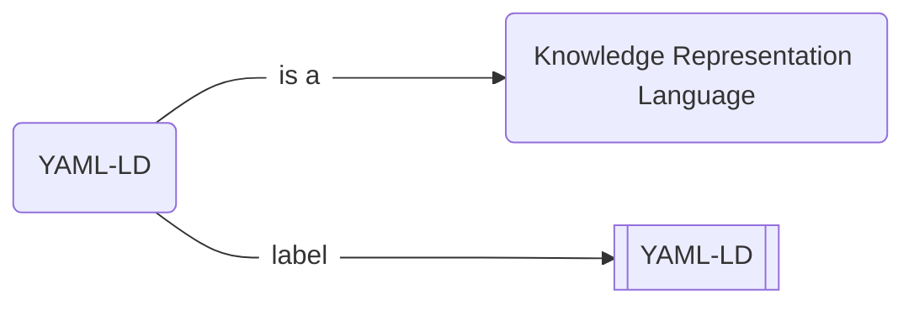
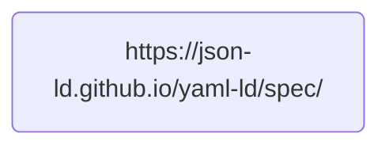

# `HOWTO` :pen_fountain: Write and publish a Nanopublication

# What is a nanopublication?

!!! danger "This is an α version"
    I am presently working on this article, and it is a very early alpha version. If you happen to read it before I am finished, please forgive the sketchiness. You are very welcome to contribute and to criticize though! Just [➕ open an issue on GitHub](https://github.com/iolanta-tech/iolanta/issues/).

I have been working on a thing called YAML-LD, and I want to tell the world what it is. I like infographics, so I might draw the following :simple-mermaid: Mermaid diagram.

{# TODO: Generate this diagram from YAML-LD file. #}



This graph obviously says that:

* YAML-LD is named "YAML-LD"<br/>(well *that* was unexpected),
* and it is a **knowledge representation language**,<br/>whatever *that* might be.
 
It does not concern us very much what these are. In your case, you might wish to inform the world about any other fact, like:

{# TODO: Each of these examples should link to a nanopub #}

* Mosquitoes bite humans,
* TRAPPIST-1 system has 7 planets,
* Pluto is not a planet,
* or even that,
    * even though **John Doe** says that **every dinosaur is a reptile**,
    * that statement is **false**,
        * because
            * Chicken is a dinosaur
            * Chicken is a bird, not a reptile.

All of these statements can be drawn as graphs similar to the above. Let's do so.

## Install prerequisites

In a Python environment, run:

```shell
pip install iolanta
```

## :material-typewriter: Write an Assertion

Create a new file, called `yaml-ld.yamlld`, and run, in a separate terminal:

```shell
iolanta yaml-ld.yamlld
```

<div class="grid" markdown>
<div markdown>
```shell title="yaml-ld.yamlld"
--8<-- "docs/howto/nanopublish/0.yamlld"
```

As you can see on the right, Iolanta has certain difficulties visualizing this document. Well, that's because there is nothing to visualize. The line starting from `#` is a comment in YAML, it is only written for a human reader; computer ignores it entirely.
</div>


</div>

### Step :material-roman-numeral-1:

<div class="grid" markdown>
<div markdown>
We are going to write something about YAML-LD; let's refer to it properly: as a URL. We can use the address of current YAML-LD [specification draft](https://json-ld.github.io/yaml-ld/spec/).

```shell title="yaml-ld.yamlld"
--8<-- "docs/howto/nanopublish/with-id.yamlld"
```

Here, `$id` is a keyword that *`id`entifies* the thing we are going to talk about. However... Iolanta still cannot visualize this document, why is this?
</div>


</div>

### Step :material-roman-numeral-2:

<div class="grid" markdown>
<div markdown>
We need to add some more magic words to make something visible.

```yaml title="yaml-ld.yamlld" hl_lines="1 2"
--8<-- "docs/howto/nanopublish/with-context.yamlld"
```

`@context` part of the document defines how the rest of the document will be understood. Note that this word is in quotes, that's obligatory because of how YAML treats the symbol `@`. Every keyword inside `@context` must use `@` and be quoted.

The `dollar-convenience.jsonld` context that we import here defines `$id`. Dollar sign does not need to be quoted, which will make our next additions less verbose.

But... it still does not work, what's wrong with all this stuff?!
</div>


</div>

### Step :material-roman-numeral-3:

<div class="grid" markdown>
<div markdown>
Ahem. Yes, indeed, I am sorry. The problem now is that the graph we have described only has one node, but no edges.



This degenerated form is not really a graph and is not quite supported by Iolanta, unfortunately. We need to *say something about* the thing that we had stated. Otherwise there's no semantics to talk about, no knowledge to express. Let's do that.

```yaml title="yaml-ld.yamlld" hl_lines="3 6"
--8<-- "docs/howto/nanopublish/with-label.yamlld"
```

And it works! What is `rdfs`, though?
</div>


</div>

RDFS stands for RDF Schema, where RDF is Resource Description Framework. But most importantly, this declaration

```yaml
rdfs: http://www.w3.org/2000/01/rdf-schema#
```

defines `rdfs:` as a **shortcut**. This means that, if the body of the document says

```yaml
rdfs:label: YAML-LD
```

then it actually is expanded to:

```yaml
"http://www.w3.org/2000/01/rdf-schema#label": YAML-LD
```

which is actually a URL that is normally used to specify a human readable, short label for something. That's what we used it for here.

### What is this good for?

<div class="grid" markdown>
<div markdown>
Now that it works, you can click the YAML-LD block.
</div>


</div>


### Step :material-roman-numeral-4:

...


# :material-owl: Draw the owl!

<div class="grid" markdown>
```shell title="yaml-ld.yamlld"
--8<-- "docs/howto/nanopublish/yaml-ld.yamlld"
```


</div>


## :eye_in_speech_bubble: Preview

{# TODO: Visualize this graph with Iolanta. #}

## :fontawesome-solid-stamp: Make it a valid Nanopublication

{# TODO: Describe how to install the `np` command #}

```shell
pyld expand yaml-ld.yamlld | np create from-assertion > np.yaml-ld.trig
```

## :material-rocket-launch: Publish!

```shell
np publish np.yaml-ld.trig
```
