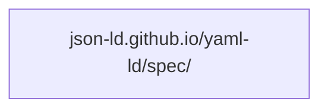
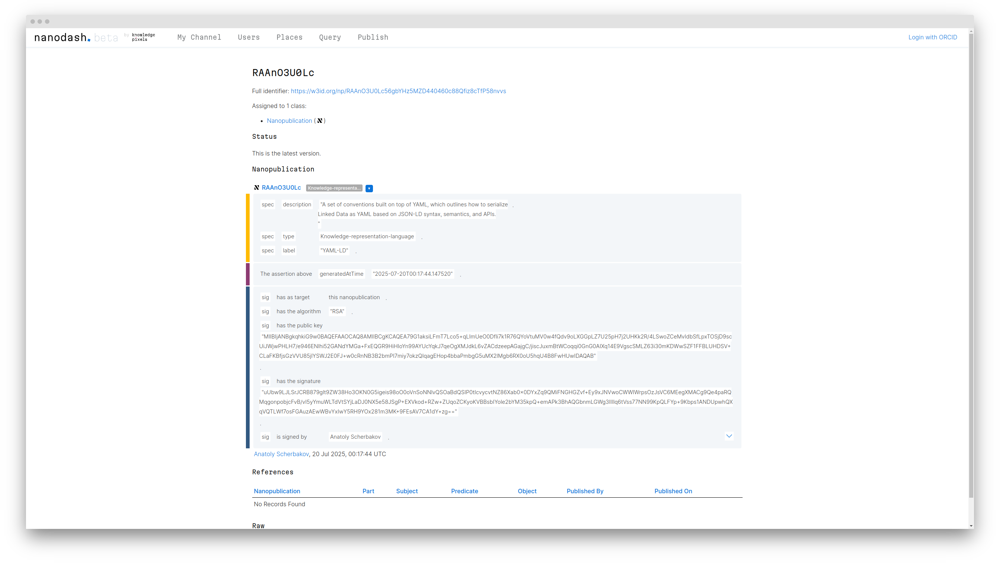

# `HOWTO` :pen_fountain: Write and publish a Nanopublication

## Knowledge Graphs

The [W3C](https://www.w3.org)…

* [JSON for Linking Data Community Group](https://www.w3.org/groups/cg/json-ld/)
* and [JSON-LD Working Group](https://www.w3.org/groups/wg/json-ld/)

…have been working on a set of conventions called **YAML-LD**. Essentially, it is a way to write [JSON-LD](https://json-ld.org) documents in [YAML](https://yaml.org). YAML-LD documents describe *knowledge graphs* — graphs of notions and relations between them.

The following diagram portrays a knowledge graph describing what YAML-LD is:

<div class="grid" markdown>
```mermaid
{{ (docs / 'howto/nanopublish/yaml-ld.yamlld') | as('mermaid') }}
```

<div markdown>
### Explanation

* YAML-LD is a Knowledge representation language *(there might be other such languages in existence)*;
* YAML-LD is a set of conventions built on top of YAML, which outlines how to serialize Linked Data as YAML based on JSON-LD syntax, semantics, and APIs.
</div>
</div>

YAML-LD will come handy later in this tutorial, but the point is that it is a topic of knowledge, a notion, which can be described within a knowledge graph. Whatever your area of interest might be, you can use knowledge graphs to describe your domain. Examples of statements in a knowledge graph could be:

* Mosquitoes bite humans;
* TRAPPIST-1 system has 7 planets;
* Pluto is not a planet;
* even though **John Doe** says that **every dinosaur is a reptile**, that statement is **false**, because a chicken is a dinosaur and a chicken is a bird, not a reptile.

The merits of expressing knowledge as Knowledge Graphs are numerous, but exploration of those is out of scope for this tutorial. We will proceed assuming that you and I are in agreement about that being worth our while.

## What is a Nanopublication?

Nanopublication is a special kind of knowledge graph which contains the following subgraphs:

* **Assertion**, describing a statement (like the one above);
* **Provenance**, describing how the statement was derived;
* **Publication Info**, describing when and how the nanopublication as a whole was published.

Nanopublications are cryptographically signed and published in the decentralized **Nanopublication Registry**. Thus, when you or I publish a nanopublication,

* It will be irrevocably attributed to the author;
* It will be protected from tampering;
* Other authors might reference it in their work by a unique ID;
* It won't disappear when one single service provider goes out of service;
* It will be machine readable, making it easy to reuse.

This will be yours, or mine, contribution to human knowledge.

Let us begin.

## :material-language-python: Install Prerequisites

In a Python 3.10+ environment, run:

```shell  { .annotate }
pip install iolanta git+https://github.com/iolanta-tech/nanopub-py.git  # (1)!
```

1. The installation of `nanopub-py` from :material-github: GitHub is required: at the moment of writing, the `np create` command, which we are going to use, is not yet available in the latest :simple-pypi: PyPI version.

## :material-typewriter: Start with an empty file

Create a new file, called `yaml-ld.yamlld`, and run, in a separate terminal:

```shell
iolanta yaml-ld.yamlld
```

<div class="grid" markdown>
<div markdown>
```shell title="yaml-ld.yamlld"
--8<-- "docs/howto/nanopublish/0.yamlld"
```

As you can see on the right, Iolanta has certain difficulties visualizing this document. Well, that's because there is nothing to visualize. The line starting from `#` is a comment in YAML, it is only written for a human reader; computer ignores it entirely.
</div>


</div>

## We are talking about YAML-LD

Knowledge Graphs normally refer to things by their URLs (there are also things called URI and IRI but we will not go into that here). If you have a link which describes the notion you are talking about, you can use that link as the identifier of the notion.

If the reader wants to know more, they can always open the link in their browser.

For YAML-LD, we can use the address of the current YAML-LD [specification draft](https://json-ld.github.io/yaml-ld/spec/).

<div class="grid" markdown>
<div markdown>
```shell title="yaml-ld.yamlld"
--8<-- "docs/howto/nanopublish/with-id.yamlld"
```

Here, `@id` is a keyword that *`id`entifies* the thing we are going to talk about.

!!! info
    `"@id"` has to be in quotes, this is because `@` is a reserved character in YAML. More on that later.

However... Iolanta still cannot visualize this document, why is this?
</div>


</div>

The problem now is that the graph we have described only has one node, but no edges, like this:



This degenerated form of a graph is still a graph, mathematically speaking, but it is not a well formed Knowledge Graph because there is no knowledge to convey about YAML-LD. We need to *say something about* the thing that we had stated, the graph has to have at least one edge.

## Specify title

<div class="grid" markdown>
<div markdown>


```yaml title="yaml-ld.yamlld" hl_lines="3 6"
--8<-- "docs/howto/nanopublish/with-label.yamlld"
```

And it works!
</div>


</div>


This display shows what is called a **triple**. Here,

* YAML-LD (red) is the _subject_,
* `label` is the _predicate_,
* and `YAML-LD` (black) is the _object_.

Subject and Predicate here are clickable, since they are URLs. Object is a string, or a Literal, and is therefore not clickable.


<div class="grid" markdown>
<div markdown>


<figcaption markdown>
[YAML-LD](http://www.w3.org/2000/01/rdf-schema#label) subject
</figcaption>
</div>

<div markdown>


<figcaption markdown>
[Label](http://www.w3.org/2000/01/rdf-schema#label) predicate
</figcaption>
</div>
</div>

As you can see, quite a bit of information is available about each. That's because files accessible via each of those URLs contain information about the concepts the URLs stand for.

That's called _Linked Data_.

## It is hard to type the `…#label` property

You will rightfully exclaim:

!!! warning "Exclamation © you"
    Are you saying I will have to type
    ```
    http://www.w3.org/2000/01/rdf-schema#label
    ```
    each time I want to specify a human readable label of something?

No, not really. Let's define a *context*.

<div class="grid" markdown>
<div markdown>

```yaml title="yaml-ld.yamlld" hl_lines="2 5"
--8<-- "docs/howto/nanopublish/with-context.yamlld"
```

Context is the part of the document where we describe how to interpret this document as a Knowledge Graph. In this example, we introduce a shortcut, `rdfs`, which stands for RDFS ontology. In the body of the document we can refer to that ontology using that shorthand.

| Short form (CURIE) | Full Form                                      |
|--------------------|------------------------------------------------|
| `rdfs:label`       | `http://www.w3.org/2000/01/rdf-schema#label`   |
| `rdfs:seeAlso`     | `http://www.w3.org/2000/01/rdf-schema#seeAlso` |
| `rdfs:Class`       | `http://www.w3.org/2000/01/rdf-schema#Class`   |

</div>


</div>

## Reduce the number of quotes

<div class="grid" markdown>
<div markdown>
```yaml title="yaml-ld.yamlld" hl_lines="2 5"
--8<-- "docs/howto/nanopublish/with-convenience-context.yamlld"
```
Here we import a context which remaps `@id` to `$id`, which does not have to be quoted in YAML.
</div>


</div>


## :material-owl: Draw the owl!

<div class="grid" markdown>
<div markdown>
With the examples we've looked through, you will easily read the following YAML-LD statement.

```yaml title="yaml-ld.yamlld"
--8<-- "docs/howto/nanopublish/yaml-ld.yamlld"
```

At any rate, Iolanta is always ready to help by visualizing it. Each of the links is clickable,
leading you to further information about the concepts involved.
</div>


</div>


## :fontawesome-solid-stamp: Make it a valid Nanopublication

```shell { .annotate }
pyld expand yaml-ld.yamlld | np create --output-format json-ld from-assertion --input-format json-ld > np.yaml-ld.jsonld    # (1)!
```

1. This command is fairly clumsy, I will see if I can make it easier in the future. Here, we have to convert YAML-LD to JSON-LD with `pyld expand` — since `nanopub-py` presently does not support YAML-LD. Then, we create the nanopublication with `np create` and store it in `np.yaml-ld.jsonld` file.


<div class="grid" markdown>
<div markdown>
Let's preview the nanopublication.

```json title="np.yaml-ld.jsonld"
--8<-- "docs/howto/nanopublish/np.yaml-ld.jsonld::10"
```

Check it out as:

```shell
iolanta np.yaml-ld.jsonld
```
</div>


</div>

Shall we consider this nanopublication fit for the world? I guess so.

## :material-rocket-launch: Publish!

```shell
np publish --test np.yaml-ld.jsonld
```
⇒

```shell
 🧪 Publishing to the test server
 📬️ Nanopub published at https://w3id.org/np/RAAnO3U0Lc56gbYHz5MZD440460c88Qfiz8cTfP58nvvs
```

!!! info "Profile setup"
    If you haven't yet set up your profile, you will be prompted to do so. Follow the recommendations given by the tool.

You can see your nanopub [published](https://w3id.org/np/RAAnO3U0Lc56gbYHz5MZD440460c88Qfiz8cTfP58nvvs) now!

[](https://w3id.org/np/RAAnO3U0Lc56gbYHz5MZD440460c88Qfiz8cTfP58nvvs)

You can also view it with Iolanta.

```shell
iolanta https://w3id.org/np/RAAnO3U0Lc56gbYHz5MZD440460c88Qfiz8cTfP58nvvs
```


## :material-ray-end: Conclusion

Iolanta helps visualize the nanopublication which you are writing, it helps confirm that the URLs you use are indeed resolving to Linked Data, thus connecting your new nanopublication to the existing body of semantically expressed knowledge.

This way, Iolanta might help avoid mistakes and make your nanopublication more readable.

YAML-LD, which we used for examples in this tutorial, provices a concise and human friendly syntax for writing Knowledge Graphs.

I hope these tools will help you in your nanopublication journey.
