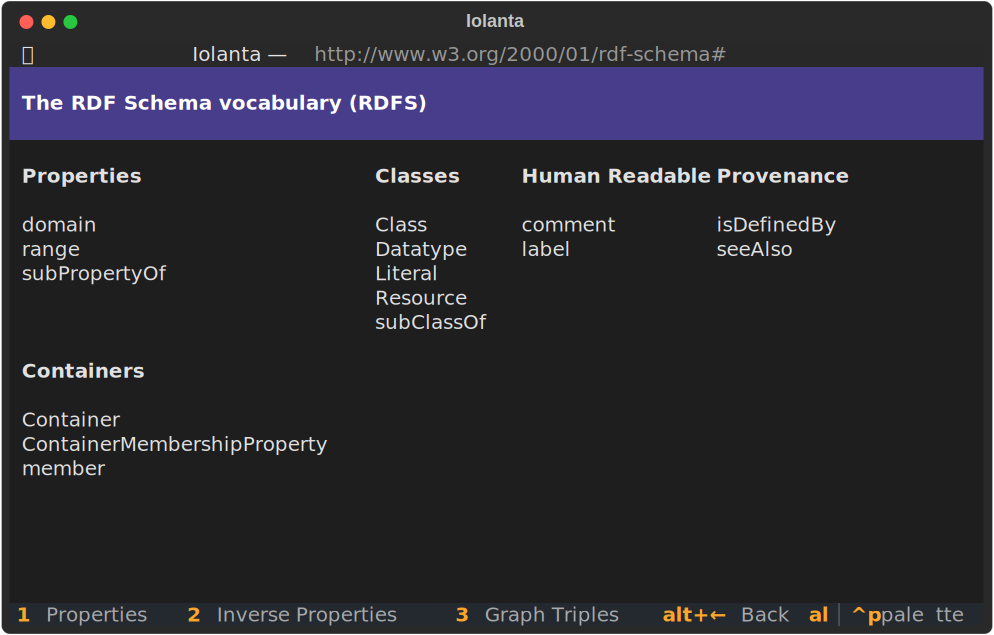

<h1>
    {{ page.meta.title }}
    <small>
        {{ page.meta.subtitle }}
    </small>
</h1>

```shell
iolanta rdfs:
```

[](/screenshots/)

## Iolanta Vocabulary

<div class="grid cards" markdown>

-   🎨 __[`Facet`](/Facet/)__

    ---

    Visualization that, given an IRI, renders it in a certain way: as a piece of text, a list, a table, a bunch of code, or maybe an interactive maze :smirk:

-   **≼** __[`is-preferred-over`](/is-preferred-over/)__

    ---

    One of the facets is generally more preferred than the other. Maybe it is more expressive, or used in a greater number of use cases, or just plain better :stuck_out_tongue_winking_eye:

</div>