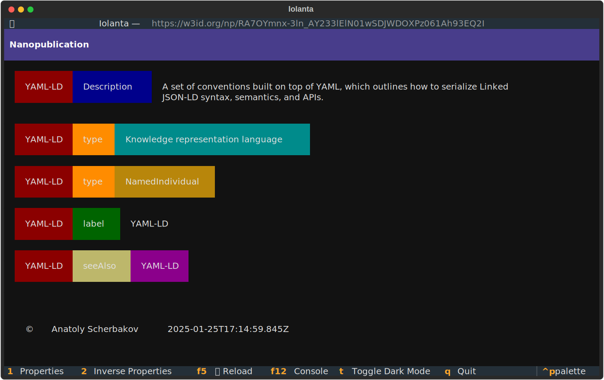
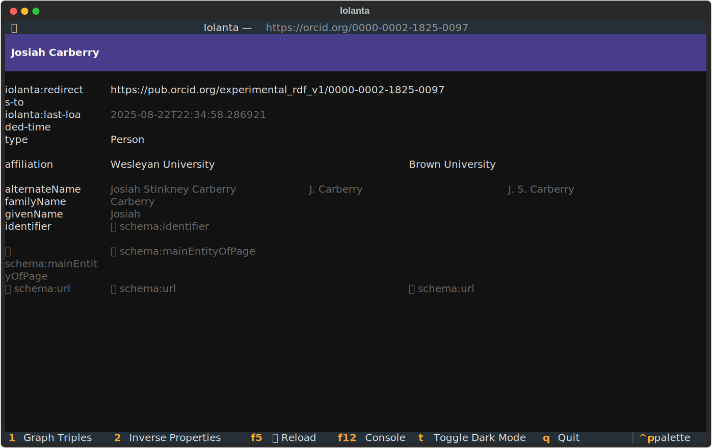
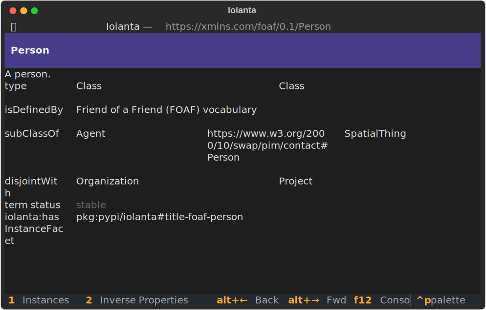

<h1>
    {{ page.meta.title }}
    <small>
        {{ page.meta.subtitle }}
    </small>
</h1>

<div class="grid cards" markdown>

-   :material-search-web: __Discover__

-   :octicons-pencil-24: __Create__

-   :octicons-eye-24: __Visualize__

</div>

<div class="cover-container">
  
  <div class="cover-title">Linked Data</div>
</div>

<h1 style="text-align: center; margin: 2em;" markdown>
    :octicons-terminal-24: In the Terminal
</h1>

=== "Nanopublication"

    ```shell
    iolanta https://w3id.org/np/RA7OYmnx-3ln_AY233lElN01wSDJWDOXPz061Ah93EQ2I
    ```
    

=== "ORCID Person Profile"

    ```shell
    iolanta https://orcid.org/0000-0002-1825-0097
    ```
    

=== "Ontology: RDF Schema"

    ```shell
    iolanta http://www.w3.org/2000/01/rdf-schema#
    ```
    

=== "Term: `Person` from Friend of a Friend Ontology"

    ```shell
    iolanta https://xmlns.com/foaf/0.1/Person
    ```
    


<script>
  document.addEventListener("DOMContentLoaded", function() {
    if (typeof jQuery === "undefined") {
      console.error("jQuery is not loaded. Check mkdocs.yml script order.");
      return;
    }

    $(document).ready(function(){
      $('.carousel').slick({
        dots: true,
        infinite: true,
        speed: 300,
        slidesToShow: 1,
        adaptiveHeight: true
      });
    });
  });
</script>

<style>
.cover-container {
    position: relative;
    text-align: center;
    color: white;
}

.cover-container img {
    width: 100%;
    height: auto;
    display: block;
}

.cover-title {
    position: absolute;
    top: 30%;
    left: 10%;
    transform: translate(-10%, -30%);
    font-size: 4rem;
    font-weight: bold;
    text-shadow: 2px 2px 10px rgba(0, 0, 0, 0.8);
}
</style>

<div class="grid cards" markdown>

-   :material-language-python: __Install & try out!__

    ---

    ```shell
    pip install iolanta
    ```
    ---

    Feel free to [➕ create an issue](https://github.com/iolanta-tech/iolanta/issues/new)!
</div>
