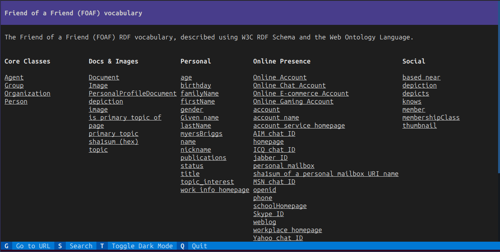

# `Ontology` <small>Facet</small>

<table>
    <tbody>
        <tr>
            <th>Is instance facet of</th>
            <td><code>owl:Ontology</code></td>
        </tr>
        <tr>
            <th>Renders in environment</th>
            <td><code>https://iolanta.tech/cli/default</code></td>
        </tr>
    </tbody>
</table>

Render a vocabulary described as `owl:Ontology`.

* Listing each of its terms connected to the ontology using `rdfs:isDefinedBy` property,
* Except those terms for which `vs:status` is `archaic` though,
* And group the terms visually by classes connected to the ontology using `vann:termGroup` property.

## Usage

```shell
iolanta browse foaf:
```


