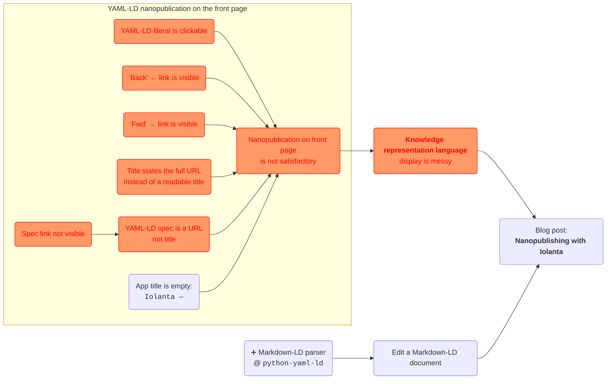

# :octicons-project-roadmap-24: Roadmap

Roadmap of Iolanta development shows known yet unsolved bugs and to-do items. Some of them are clickable: they already have their GitHub issues associated to them.

Want to contribute? Thank you, and see [:material-github: issues](https://github.com/iolanta-tech/iolanta/issues)!