# :octicons-project-roadmap-24: Roadmap

Roadmap of Iolanta development shows known yet unsolved bugs and to-do items. Some of them are clickable: they already have their GitHub issues associated to them.

!!! info "This roadmap is incomplete"
    If you have more ideas how to achieve happiness — you are more than welcome to contribute them!    

```mermaid
graph LR
    happiness("🚀 Happiness!")
    classDef happiness fill:#080,stroke:#080,stroke-width:1px,font-weight:bold;
    class happiness happiness
    
    ipfs("Render LD from IPFS") --> happiness
    
    wasm("First WASM based facet") --> generate-roadmap("Generate this roadmap<br/>from LD") --> roadmap3d("Implement a 3D view<br/>for the roadmap") --> happiness
    
    cli-construct("CLI to construct a graph") --> happiness
    
    wasm --> 3d("Render LD graph in 3D") --> happiness
    
    jeeves-sh("jeeves.sh does not expose LD") --> happiness
    class jeeves-sh bug
    
    yeti-sh("yeti.sh does not expose LD") --> happiness
    class yeti-sh bug
    
    nanopub-blog-post("Blog post:<br/><strong>Nanopublishing with Iolanta</strong>") --> markdown-nanopub-blog-post("Blog post:<br/><strong>Quick & readable Nanopublications<br/>with Markdown-LD") --> happiness
    
    nanopub-rs-graph("Publish an assertion from file<br/>@ <code>nanopub-rs</code>") --> nanopub-yaml-ld("Publish a YAML-LD assertion<br/>@ <code>nanopub-rs</code>") --> nanopub-rs
    
    plan-yaml-ld-to-pyld("Start moving stuff:<br/>Python <code>yaml-ld</code> → <code>pyld</code>") --> happiness
    
    foaf-title("FOAF Title facet<br/>only reacts on <code>foaf:Person</code> class") --> happiness
    publish-with-mkdocs("Publish LD<br/>@ <code>mkdocs-iolanta</code>") --> happiness
    class foaf-title bug
    
    tex("Embed an Iolanta visualization into a LaTeX document") --> happiness
    tractatus("Tractatus Logico-Philosophicus → LD") --> happiness
    
    starts-from-console("Iolanta starts with a blank console") --> happiness
    class starts-from-console bug
    
    subgraph "YAML-LD nanopublication on the front page"
        direction LR
        nanopublication-is-not-satisfactory("Nanopublication on front page<br/>is not satisfactory")
        class nanopublication-is-not-satisfactory bug
        
        literal-clickable("YAML-LD literal is clickable") --> nanopublication-is-not-satisfactory
        click literal-clickable "https://github.com/iolanta-tech/iolanta/issues/260"
        class literal-clickable bug
    end
    
    spec-not-ld --> happiness
    
    ld-with-facet("LD should accompany facet?") --> facet-and-widget("Merge Facet → Widget?") --> happiness
    register-widgets("Register Python widgets<br/>for safety") --> happiness
    
    subgraph "YAML-LD spec"
        spec-not-ld("Spec exposes too little LD")
        class spec-not-ld bug
        
        mismatch("Browsing <code>spec/data/spec.yaml</code><br/>≠ browsing the spec on the web") --> spec-not-ld
        class mismatch bug

        last-loaded-time("<code>iolanta:last-loaded-time</code><br/>is not rendered") --> spec-not-ld
        class last-loaded-time bug
        
        spec-toc("Spec does not have a table of contents") --> spec-not-ld
        class spec-toc bug
        
        more("Invent more things<br/>to add to the YAML-LD representation<br/>of the spec") --> spec-not-ld
    end
    
    nanopublication-is-not-satisfactory --> nanopub-blog-post
    
    python-yaml-ld-markdown-ld("➕ Markdown-LD parser<br/>@ <code>python-yaml-ld</code>") --> markdown-ld("Edit a Markdown-LD document") --> markdown-nanopub-blog-post
    click markdown-ld "https://github.com/iolanta-tech/iolanta/issues/261"
    markdown-ld --> no-data("iolanta.tech/is-preferred-over<br/>no data found") --> nanopub-blog-post
    class no-data bug
    
    generate-facets-list("Generate Facets list") --> happiness
    click generate-facets-list "/Facet/"
    
    comunica-anything("I cannot make<br/><code>comunica-sparql-link-traversal</code> work") --> comunica-np("<code>comunica-sparql-link-traversal</code><br/>cannot retrieve properties<br/>about a nanopub") -->  use-comunica("Replace <code>CyberspaceSPARQLProcessor</code><br/>→ <code>comunica-sparql-link-traversal</code>") --> happiness
    
    subgraph nanopub-tool["Publish nanopubs with"]
        direction TB
        nanopub-rs["nanopub-rs"]
        nanopub-py["nanopub-py"]
    end
    
    nanopub-tool --> nanopub-blog-post
    
    rdflib-yaml-ld("<code>rdflib-yaml-ld</code>") --> publish-yaml-ld-with-nanopub-py("Publish a YAML-LD assertion<br/>with <code>nanopub-py</code>") --> nanopub-py
    
    np-create("Get <code>np create</code><br/>released") --> publish-yaml-ld-with-nanopub-py

    class comunica-anything bug
    class comunica-np bug
    
    sparqlspace-cli("<code>sparqlspace</code> CLI") --> happiness
    sparqlspace-query-plugin("Query-based") --> sparqlspace-cli
    sparqlspace-results-plugin("Result-based") --> sparqlspace-cli
    sparqlspace-disk("<code>sparqlspace</code><br/>loads files from disk") --> sparqlspace-cli
    sparqlspace-protect-meta("<code>sparqlspace</code><br/>protects <code>_meta<code></br>graph") --> sparqlspace-cli
    
    facet-with-data("Register a facet class<br/>together with its associated LD") --> happiness
        
    classDef bug fill:#700,stroke:#f00,stroke-width:1px;
```

!!! success "Or, maybe you want to help achieve happiness with code?"
    Thank you, and see [:material-github: issues](https://github.com/iolanta-tech/iolanta/issues)!
