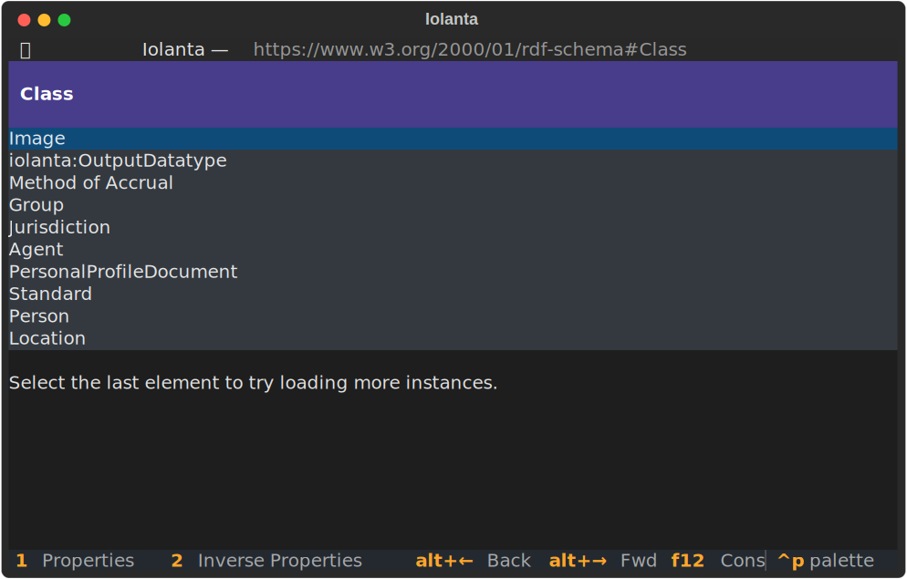
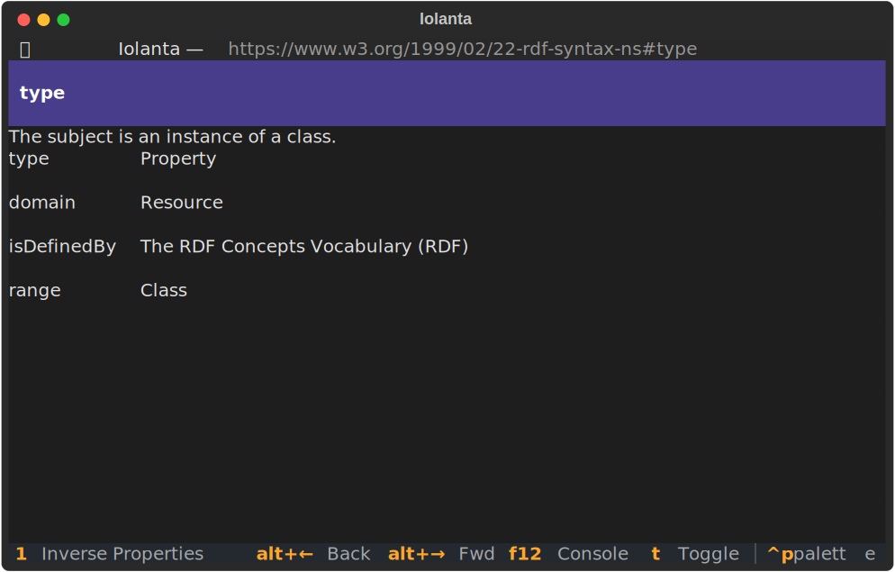
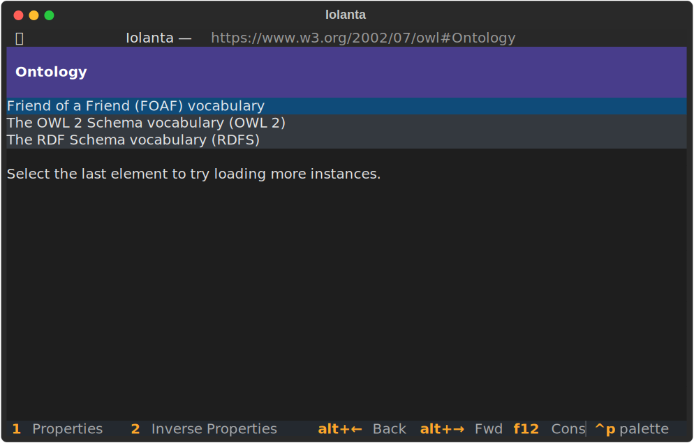
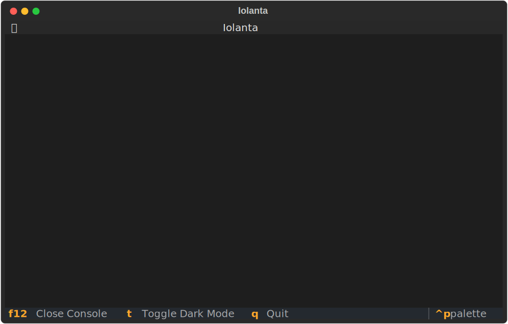

# :material-monitor-screenshot: Screenshots

-   :material-code-greater-than:{ .lg .middle } __`iolanta rdfs:`__

    ---

    

    RDFS Vocabulary.

-   :material-code-greater-than:{ .lg .middle } __`iolanta rdfs:Class`__

    ---

    

    RDFS Class and its instances.

-   :material-code-greater-than:{ .lg .middle } __`iolanta rdf:`__

    ---
        
    

    RDF Vocabulary.

-   :material-code-greater-than:{ .lg .middle } __`iolanta rdf:type`__

    ---
        
    

    RDF Type property and its properties.

-   :material-code-greater-than:{ .lg .middle } __`iolanta owl:`__

    ---
        
    

    Web Ontology Language Vocabulary. 

- :material-code-greater-than:{ .lg .middle } __`iolanta owl:Ontology`__

    ---
        
    

    Class of ontologies. 

-   :material-code-greater-than:{ .lg .middle } __`iolanta foaf:`__

    ---
        
    

    Friend of a Friend Vocabulary, Person class.

-   :material-code-greater-than:{ .lg .middle } __`iolanta vann:`__

    ---
        
    

    VANN Vocabulary.

-   :material-code-greater-than:{ .lg .middle } __`iolanta https://www.wikidata.org/entity/Q204606`__

    ---
        
    

    Cyberspace page @ Wikidata.

